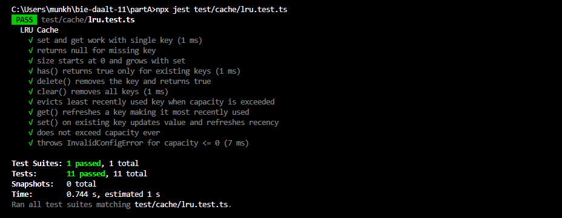
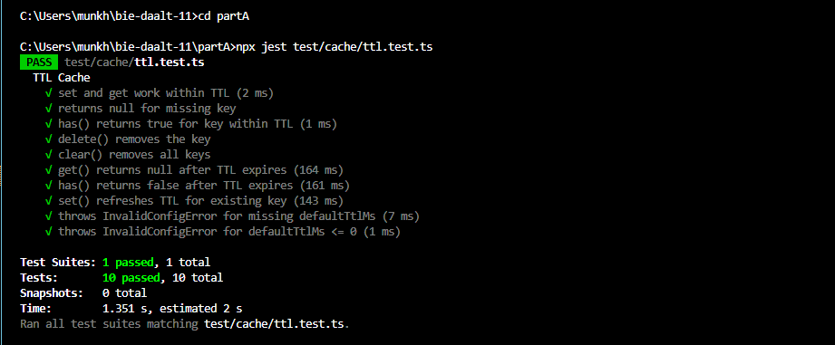
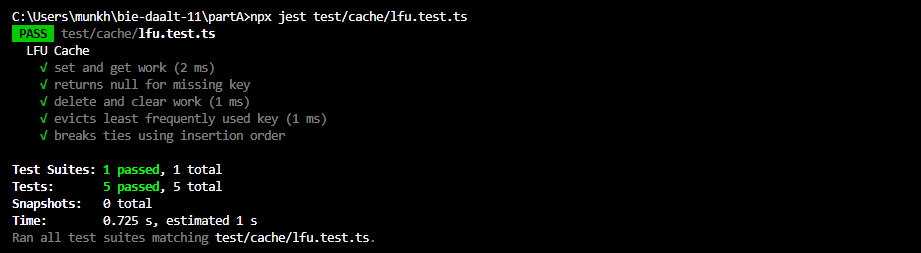
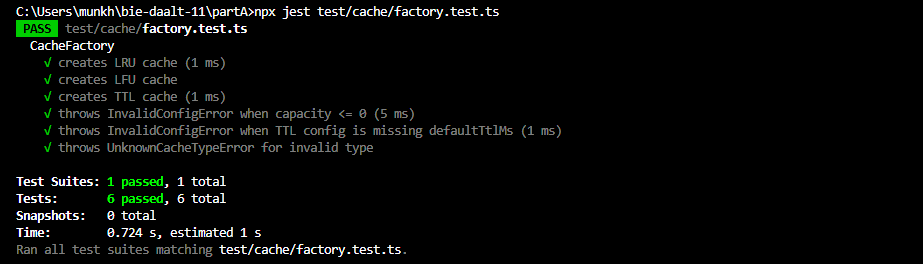
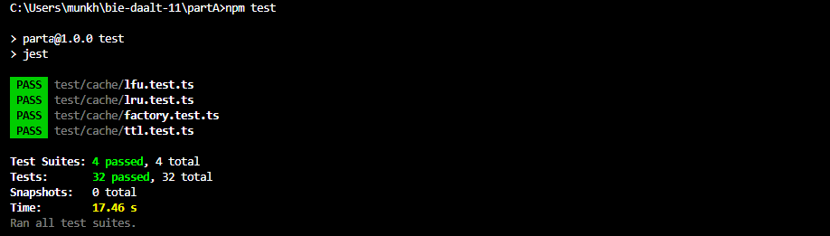

# bie-daalt-11
• Оюутны нэр: М.Мөнхүүжин, 
• Код: B242270135, 
• Лаб: 2-5

## Товч танилцуулга
Энэ repo нь F.CS311 хичээлийн 11-р бие даалтын ажлын хүрээнд хийсэн. Нийтдээ хоёр хэсгээс бүрдэнэ.

А хэсэгт API дизайны зарчмуудыг бодит код дээр хэрэгжүүлэхийг зорьсон. Лекц дээр үзсэн “муу API”-ийн жишээг эхлээд задлаад, ямар асуудал байгааг нь харж, дараа нь засварласан. Үүний дараа нэг public интерфейстэй, 3 өөр хэрэгжилттэй жижиг сан (library) өөрсдөө хийсэн. Сэдвээ cache гэж сонгосон бөгөөд LRU, LFU, TTL гэсэн гурван хувилбараар хэрэгжүүлсэн.

Б хэсэгт номын сангийн ном зээлэх REST API хийсэн. Express + TypeScript ашигласан бөгөөд Postman collection-оор тестүүдийг нь автоматжуулсан. Мөн бодит хэрэглээнд ойртуулахын тулд 5 номын лимит, 14 хоногийн хугацаа, нэг удаа сунгах зэрэг бизнес дүрмүүдийг оруулсан.

## А хэсгийг ажиллуулах

```bash
cd partA
npm install
npm test
```

Бүх 32 тест PASS гарна (LRU 11, TTL 10, LFU 5, Factory 6).

## Б хэсгийг ажиллуулах

```bash
cd partB
npm install
npm start
```

Server `http://localhost:3000`-д ажиллана. Health check: `GET /health`.

Postman ажиллуулах нарийн заавар нь `partB/README.md`-д бий.

## Тулгарсан гол зүйлс

**А хэсэгт** TypeScript-н Cache type нь DOM API-д бас байдгийг tsconfig тохируулах 
үед мэдсэн. Backend-д DOM хэрэггүй учир `lib: ["ES2022"]` тохируулж DOM-г 
хассан. Энэ нь нэг 30 минут идсэн алдаа байсан.

LRU-ийн eviction логикийг анх буруу бичсэн — capacity дүүрэх үед хамгийн эртний 
key-г устгахаас өмнө шинэ key оруулчихсан байсан тул size capacity-аас давчихсан 
байсан. Тест ажиллуулах явцад илрүүлж зассан.

**Б хэсэгт** Postman дээр RFC 7807 алдааны Content-Type шалгахдаа 
`pm.response.to.have.header("Content-Type", "application/problem+json")` гэж 
шууд бичсэн чинь fail болов. Express нь `; charset=utf-8` нэмж буцаадаг учир 
`pm.expect(contentType).to.include(...)` болгож зассан.

JWT token-ийн хугацаа 1 цаг байсан тул удаан ажиллах үед дахин login хийх 
шаардлагатай болсон. Postman Runner бүх тестүүд 1 секундад ажилладаг учир 
энэ нь практикт асуудалгүй болсон.

## Дүгнэлт

Лекц 11-д үзсэн API дизайны зарчмууд (мэдээллийн далдлалт, нэршил, ойлголтын 
жинг багасгах, REST) бодит кодод яаж хэрэгждгийг сайн ойлгосон. Ялангуяа 
3 хэрэгжилттэй сан хийх ажил нь интерфейс зөв байх ёстой гэдгийг ойлгуулсан 
— нэг хэрэгжилт хийгээд интерфейс гаргахад дараа нь өөр хэрэгжилт хийхэд 
тохирохгүй байх асуудал гарсан.

REST API дээр HTTP статус кодыг зөв ашиглах нь чухал гэдгийг ойлгосон. Жишээ 
нь "5+ ном зээллээ" гэдэг нь 400 биш 422, "ном аль хэдийн зээлэгдсэн" нь 
404 биш 409. RFC 7807 ч мөн эхлээд аль ч REST API-д харж байгаагүй боловч 
маш хэрэгтэй стандарт.

Дараагийн удаа OpenAPI yaml-ыг гараар бичихгүй, swagger-jsdoc эсвэл tsoa зэрэг 
сангаар автомат үүсгэх юм бол илүү хурдан байх. Мөн in-memory storage-аас 
жинхэнэ DB (SQLite, Postgres) руу шилжих нь ажил дуусахад илүү бодитой 
системтэй болох байсан.


Хийсэн ажлын тайлан: A хэсэг

Commit 1

Repo-г анх үүсгээд GitHub руу push хийсэн. README.md, .gitignore-ийг эхлээд нэмсэн. 

Commit 2

-Төслийн ерөнхий бүтэц гаргаж, partA, partB гэсэн folder-ууд үүсгээд, даалгаврын дагуу салгасан.
-Мөн өгөгдсөн usr_mgr классыг src/bad/ дотор тайлан дээрх bad api кодыг хуулж тавьсан.

Commit 3

-Bad API-г лекцийн агуулгын дагуу маш нарийн шинжэлж харахад 10 дизайны алдаа олж илрүүлээд тус бүрийг partA/README.md тайлбарлаж бичсэн. (flag ашигласан method ба id/email холисон хэсэг) г/м зарим нь хоорондоо холбоотой юм шиг санагдсан.

Commit 4

Good API-ийн бүтцийг яаж хуваахаа бага зэрэг бодсон. Шууд нэг файлд бичихээс илүү салгаж өгөх нь дээр юм шиг санагдсан. 

src/good/ дотор:

- types/
- errors/ - гэж 2 фолдер болгож салгасан ба types болон errors folder доторх file-ийн загвар skeleton маягаар ямар файл байх вэ? гэдгийг урьдчилж гаргаж өгсөн.

-types/ дотор:

user.ts
dto.ts
search.ts
config.ts гэсэн файлууд байхаар төлөвлөсөн. Бас index.ts нэмээд дараа нь нэг дороос export хийхээр бодсон.

-errors/ -фолдерд ч бас адилхан:

base error (UserManagerError) дараа нь тусгай error-ууд нэмэхээр placeholder файл үүсгэсэн. UserManager.ts болон root index.ts-ийг ч бас энэ үед үүсгэсэн, гэхдээ доторх кодуудыг нь хараахан бичээгүй. Зүгээр л бүтцийг гаргаж өгсөн.

Commit 5

Өмнөх commit дээрх хийсэн types/ фолдер доторх файлуудыг нэлээд дэлгэрүүлж файл хоорондын уялдаа холбоог тодорхойлж, кодыг бичсэн.

-Эхлээд user.ts дээр ажилласан. User interface болон UserStatus enum-ийг тодорхойлсон. Status-ийг string байлгах уу enum болгох уу гэж эргэлзсэн, гэхдээ enum байвал алдаа бага гарна гэж үзээд enum болгосон.

-Дараа нь dto.ts дээр CreateUserDto, UpdateUserDto хоёрыг салгаж өгсөн. Эхэндээ нэг interface ашиглах уу гэж бодсон ч create ба update хоёрын шаардлага өөр болохоор тусад нь байвал дээр юм шиг санагдсан.
-CreateUserDto дээр заавал хэрэгтэй талбарууд
-UpdateUserDto дээр optional талбарууд (partial update хийхэд хэрэгтэй гэж үзсэн) гэсэн байдлаар ялгасан.

-search.ts дээр жаахан гацсан. Анхны find(q: string)-ийг яаж сайжруулах вэ гэж бодож байгаад, эцэст нь object болгосон нь илүү ойлгомжтой санагдсан (UserSearchCriteria). Ингэснээр ямар талбараар хайж байгааг илүү тодорхой болгоно.

-config.ts дээр timeout-ийг хаана хадгалах вэ гэдгийг шийдсэн. Method бүрт дамжуулах нь жаахан давтагдсан санагдсан тул config объект болгож нэг дор төвлөрүүлсэн (timeoutMs). Мөн бүх types-ийг нэг дороос import хийж болохоор index.ts файл нэмсэн.

Нийтдээ commit 5-ийн хүрээнд  “зөв structure дээр type-уудаа суулгах” дээр төвлөрсөн.

Commit 6

errors/ хэсгийг энэ commit дээр бичсэн. Эхэндээ энгийн Error ашиглах уу гэж бодсон ч дараа нь нэг стандарттай болгох нь дээр юм шиг санагдсан. Ялангуяа өмнөх код дээр 'ERR_404' гэх мэт string буцааж байсан нь жаахан эвгүй харагдсан. Тиймээс эхлээд суурь class хийсэн:

-UserManagerError — бүх алдааны base class (code талбар нэмсэн, дараа нь хэрэг болох байх гэж бодсон). Дараа нь түүнээс удамшуулж хэд хэдэн тусгай error-ууд нэмсэн:

UserNotFoundError — user олдохгүй үед
DuplicateEmailError — email давхцах үед
InvalidInputError — буруу input (энд field, reason нэмсэн)
RepositoryError — DB талын алдааг шууд гаргахгүйн тулд wrap хийсэн
Ялангуяа SQLException-ийг шууд гаргахгүй, RepositoryError болгож байгаа нь арай зөв санагдсан. Ингэснээр дээд талын код DB-ийн талаар мэдэх шаардлагагүй болно. Мөн index.ts нэмээд бүх error-уудыг нэг дороос export хийдэг болгосон — дараа нь import хийхэд амар. Энэ commit дээр яг error-уудын бүтцийг жигдрүүлж зөв болгохыг зорьсон.

Commit 7

Энэ commit дээр UserManager.ts-ийг бичиж дуусгасан. Өмнөх commit-ууд дээр types, errors-оо бэлдчихсэн байсан болохоор одоо тэднийг ашиглаад үндсэн логик, кодоо угсарч эхэлсэн. Эхэндээ хуучин do_user_op шиг нэг method байлгах уу гэж бодсон (кодыг шууд replace хийх маягаар), гэхдээ бичиж эхлэхэд төвөгтэй санагдаад болисон. Тэгээд дараах байдлаар тус тусад нь method-ууд гаргасан:

createUser
updateUser
deleteUser
restoreUser

Ингэснээр код уншихад илүү ойлгомжтой амар болж өгсөн. Мөн өмнөх get_u(id_or_email, flag) хэсгийг салгаад:

getUserById
getUserByEmail - гэж хоёр тусдаа функц болгосон. Flag ашиглах нь үнэхээр эвгүй, хүндрэлтэй байсан болохоор.

-searchUsers(criteria) гэдэг method нэмсэн — өмнөх find(q)-ээс илүү тодорхой болсон. Ямар талбараар хайж байгааг шууд харж болдог.
-Дотоод users массив болон config-ийг private readonly болгосон. Эхэндээ public байлгах уу гэж бодсон ч гаднаас өөрчлөгдөх эрсдэлтэй санагдсан.
-Constructor дээр UserManagerConfig авдаг болгосон — timeout зэрэг тохиргоог нэг дор байлгах нь илүү цэгцтэй юм шиг.
-Error handling дээр өмнө хийсэн error class-уудаа ашигласан. String буцаахаа больж, шууд exception throw хийдэг болгосон. Ингэснээр API-ийн contract илүү тогтвортой болсон.
-Мөн энэ commit дээр good/index.ts нэмсэн. Бүх зүйлээ нэг entry point-оос export хийвэл дараа нь import хийхэд амар санагдсан. Энэхүү commit-ийн хүрээнд дээр өмнөх commit-ууд дээр бэлдсэн бүх хэсгийг нийлүүлж, ажилладаг API болгосон гэж хэлж болно.

Commit 8

Энэ commit-оор A.2 хэсгийг эхлүүлж кэш санг сонгоод, кэш сангийн ерөнхий API-г эхлээд тодорхойлсон. Эхэнд нь шууд LRU, LFU, TTL хэрэгжилт рүү орох уу гэж бодсон ч интерфейсээ түрүүлж гаргах нь илүү зөв санагдсан тул Cache интерфейсийг бичиж эхэлсэн. Үүнд get, set, has, delete, clear, size зэрэг нийтлэг үйлдлүүдийг нэг стандарттай болгож өгсөн. Мөн утгын төрлийг уян хатан байлгахын тулд generic (<V>) ашигласан.

Дараа нь CacheFactory классыг нэмээд кэш үүсгэх логикийг нэг дор төвлөрүүлсэн. Одоогоор дотор нь switch ашиглаж төрөл сонгож байгаа ч, хэрэгжилтүүд хараахан бэлэн болоогүй тул түр not implemented алдаа шиддэг байдлаар үлдээсэн. Дараагийн commit-уудаар LRU, LFU, TTL хэрэгжилтүүдийг тус бүрд нь нэмж холбоно. Ингэснээр concrete классуудаа шууд ил гаргахгүй байх шаардлагыг хангаж байгаа.

Мөн алдааны хэсгийг цэгцлэх зорилгоор CacheError суурь класс болон түүнээс удамшсан хэд хэдэн тусгай алдааг (InvalidConfigError, UnknownCacheTypeError) нэмсэн. Эцэст нь index.ts файл үүсгэж, сангийн public API-г нэг entry point-оос export хийдэг болгосон тул гаднаас ашиглахад илүү цэгцтэй болсон.

Commit 9

LRU cache-ийг энэ commit-оор хийж дуусгасан. Эхэндээ classic doubly linked list ашиглах уу гэж бодсон, гэхдээ JavaScript-ийн `Map` нь оруулсан дарааллыг өөрөө хадгалдаг гэдгийг санаад түүгээр хийх нь хамгийн хялбар санагдсан.

Үндсэн санаа нь:

- `get` хийхэд key байвал устгаад дахин нэмнэ → дараалал шинэчлэгдэнэ
- `set` хийхэд capacity дүүрсэн бол `map.keys().next().value`-аар хамгийн эртнийг устгана
- `has`, `delete`, `clear`, `size` бол шууд Map-ийн method-ийг буцаасан

Эхний хувилбар бичсэний дараа жаахан туршиж үзэхэд capacity дүүрсэн үед яаж evict хийж байгаа дээр алдаа гарсан — `set` дотор `else if` нөхцөл буруу шалгасан байсан болохоор. Тухайлбал capacity дүүрсэн үед хамгийн эртний key-г устгахаас өмнө шинэ key-г оруулчихсан байсан, тэгээд size capacity-аас давчихсан байсан. Тэр хэсгээ дахин харж засаад comment-уудыг ч жаахан тодруулсан болохоор хоёр дахь commit (fix) гарсан.

`Cache<V>` interface-ийг implement хийж байгаа болохоор concrete class гадагш гарахгүй гэдгийг хадгалсан. Гадны код Factory-аар л дамжуулж үүсгэнэ — `new LRUCache(...)` гэж шууд ашиглах боломжгүй.

Commit 10

Commit 9-д хийсэн LRU cache-н eviction логикт жижиг алдаа байсан болохоор зассан. Тухайлбал capacity дүүрсэн үед хамгийн эртний key-г устгахаас өмнө шинэ key-г оруулчихсан байсан, тэгээд size capacity-аас давчихсан байсан. `set` дотор `else if` нөхцөл буруу шалгасан байсан болохоор. Дахин харж засаад comment-уудыг ч жаахан тодруулсан болохоор fix commit гарсан.

Commit 11

LRU cache-н unit тестүүдийг энэ commit-оор бичсэн. Эхлээд Jest суулгахын тулд `npm install --save-dev jest ts-jest @types/jest` хийгээд `jest.config.js`-аа `preset: 'ts-jest'`-той тохируулсан. Анх удаа ts-jest-тэй ажиллаж байгаа болохоор хэд хэдэн алдаатай тулгарсан.

Эхлээд `describe`, `expect`, `test` гэдэг функцуудыг танихгүй гэж алдаа гарсан. VS Code Problems цонх 37 алдаа харуулсан. `tsconfig.json`-д `"types": ["jest", "node"]` нэмэхэд шийдэгдсэн.

Дараа нь өөр алдаа гарсан — `Cache` гэдэг өөрийн interface DOM-ийн built-in `Cache` (Service Worker API)-тай зөрөлдөж байсан. Backend project-д DOM type хэрэггүй болохоор `"lib": ["ES2022"]` нэмж DOM-г хасахад зассан.

Тестүүдийг 3 хэсэг болгож бичсэн:

- Үндсэн үйлдлүүд (set, get, has, delete, clear, size)
- LRU логик (eviction policy — хамгийн чухал)
- Алдааны шалгалт (capacity ≤ 0 үед InvalidConfigError)

Нийт 11 тест болсон. Хамгийн чухал нь "get() refreshes a key" гэдэг тест — A-г уншсаны дараа D нэмбэл B устах ёстой. `beforeEach` дотор тест бүрд шинэ кэш үүсгэснээр тестүүд бие биенээсээ хамаарахгүй болсон.



Commit 12

TTL cache-ийг энэ commit дээр хийсэн. Эхэндээ `setTimeout` ашиглаж автоматаар expire хийдэг болгох уу гэж бодсон, гэхдээ олон key-тэй болоход timer-ууд хуримтлагдаад memory асуудал гарч магадгүй санагдсан. Тэгээд lazy expiration аргыг сонгосон — өөрөөр хэлбэл `get` эсвэл `has` хийх үед л expire хийгдсэн эсэхийг шалгана.

Хадгалах хэлбэр нь `{ value, expireAt }` объект — `Date.now() + defaultTtlMs` гэж expireAt timestamp гаргана. `get` үед одоогийн цагтай харьцуулна.

CacheFactory-н "ttl" case-аас "not implemented yet" throw-г хасаад `new TTLCache<V>(config.capacity, config.defaultTtlMs)` болгож холбосон. `defaultTtlMs` шалгалт өмнө factory дотор бичсэн байсан учраас тэрийг өөрчлөх шаардлагагүй болсон.

Жижиг `ttl-demo.ts` файл үүсгэж 500ms ба 1500ms-д get хийж шалгасан — 500ms-д утга буцаасан, 1500ms-д null. Лог нь яг хүлээгдсэнчлэн гарсан болохоор demo файлаа устгаад commit хийсэн.

`size()` method дээр жаахан эргэлзсэн. Expire хийгдсэн ч устгагдаагүй key-үүдийг яах вэ гэдэг асуудал. Бодит идэвхтэй элементийг тоолохын тулд бүх key дээр get хийж шалгах хэрэгтэй болно — гэхдээ энэ нь performance муу. Эцэст нь `Map.size` шууд буцаахаар үлдээсэн, JSDoc дотор энэ зан чанарыг тэмдэглэсэн.

Commit 13

TTL cache-н тестүүдийг бичсэн. LRU тестээр нэг бүх юм арван удаа давтсан 
шиг санагдсан болохоор энэ удаа жаахан өөр зохиосон — capacity 5, TTL 100ms 
гэж тохируулсан.

Хамгийн хэцүү нь TTL-тай тест бичих байсан. Хугацаа хүлээх ёстой болохоор 
async ашиглах хэрэгтэй болсон. setTimeout-аас Promise хийдэг helper нэг 
үүсгэж бараг бүгдэд нь ашигласан.

Тестүүдийг 3 хэсэгт хуваасан:

- Энгийн үйлдлүүд (set, get, has, delete, clear)
- TTL зан чанар (хугацаа дуусаад null болох, set дахин хийхэд refresh болох)
- Алдааны шалгалт (defaultTtlMs дутуу эсвэл 0 байх үед)

Нийт 10 тест бичсэн. set() refreshes TTL гэдэг тест хамгийн төвөгтэй санагдсан 
— цаг бодож бичих ёстой болсон. 60ms хүлээгээд set дахин хийгээд дахин 60ms 
хүлээгээд утга үлдсэн эсэхийг шалгана. Анх 50/70 ms ч гэж бичсэн ч тестийн 
найдвартай байх үүднээс тэгш тоонууд илүү ойлгомжтой санагдаад өөрчилсөн.

Бүх тест нэг secund хүрэхгүй хугацаанд гүйцэт ажиллаж байгаа.



Commit 14

LFU cache-г энэ commit-оор хийсэн. Бусад хоёртой харьцуулахад жаахан өөр 
санагдсан — энд "хэзээ" биш "хэдэн удаа" гэдгийг хадгалах хэрэгтэй болохоор 
тусдаа Map хэрэглэх шаардлагатай болсон.

Үндсэн санаа:

- Нэг Map-нд value хадгална (бусад cache-тэй адил)
- Хоёр дахь Map-нд key тус бүрийн frequency
- get эсвэл set хийх бүрд frequency 1-ээр нэмэгдэнэ
- Capacity дүүрсэн бол хамгийн бага freq-тэйг устгана

Хамгийн бага freq-тэйг олохын тулд Map бүхэлд нь scan хийсэн. O(n) болохоор 
тийм ч сайн биш, гэхдээ хичээлийн төсөлд илүү нарийн algorithm хэрэг болохгүй 
санагдсан.

Tie-breaking жаахан төвөгтэй санагдсан. Хоёр key ижил freq-тэй байвал алийг устгах вэ? Эцэст нь Map-н insertion order-г ашигласан — JavaScript-н Map 
оруулсан дарааллаа хадгалдаг учир for...of-ээр явахад хамгийн эртний нь эхэнд олдоод устана. LRU-д ашигласан зүйл шиг.



Factory дотор lfu case-аас "not implemented" хасаад LFUCache-г холбосон. 
Capacity-н шалгалт өмнө байсан болохоор нэмэлт өөрчлөлт шаардагдаагүй

Commit 15

LFU болон CacheFactory-н unit тестүүдийг бичсэн. LFU дээр 5 тест — энгийн үйлдлүүд, eviction logic, tie-breaking. Factory дээр 6 тест — гурван cache төрөл үүсгэх + алдааны нөхцөлүүд.



Бүх 4 тестийн файл болон нийт 32 тестийн PASS болсон screenshot-уудыг screenshots/ хавтсанд хадгалж README-д оруулсан.

 

Commit 16

partA/README дээр А.2 хэсгийг нэмж, cache сангийн дизайны шийдлүүдийг товч тайлбарласан. Ерөнхий бүтэц, public interface, LRU/TTL/LFU хэрэгжилт, factory болон алдааны системийг дараалалтайгаар бичсэн.

Яагаад ийм шийдэл сонгосон, ямар trade-off хийснийг товч дурдсан бөгөөд А.1 дээрх муу API-тай харьцуулж ялгааг нь харуулсан.

Мөн тестийн screenshot-уудыг screenshots/ хавтсаас холбоод оруулсан. Markdown дээр Cache<V> гэх мэт generic-уудыг зөв харагдуулахын тулд backtick ашиглаж зассан.