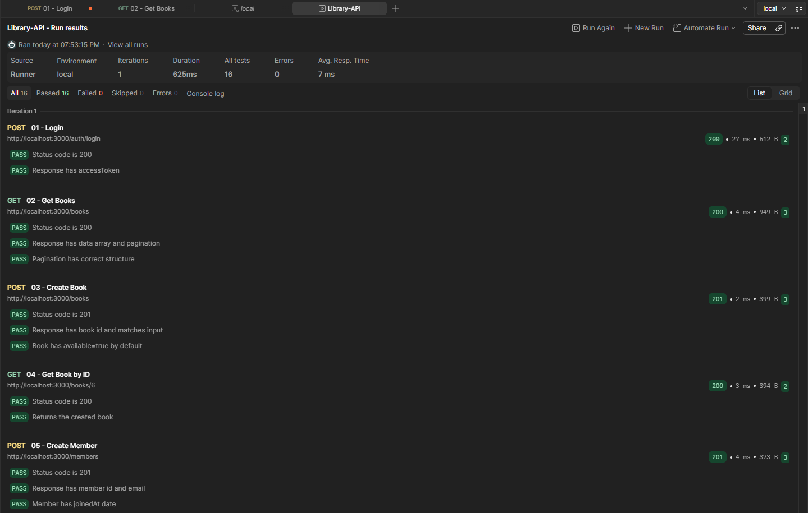
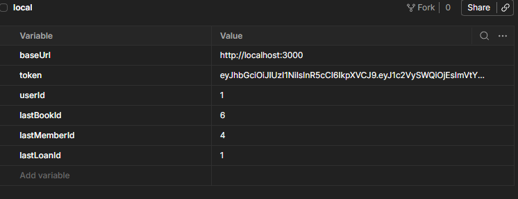
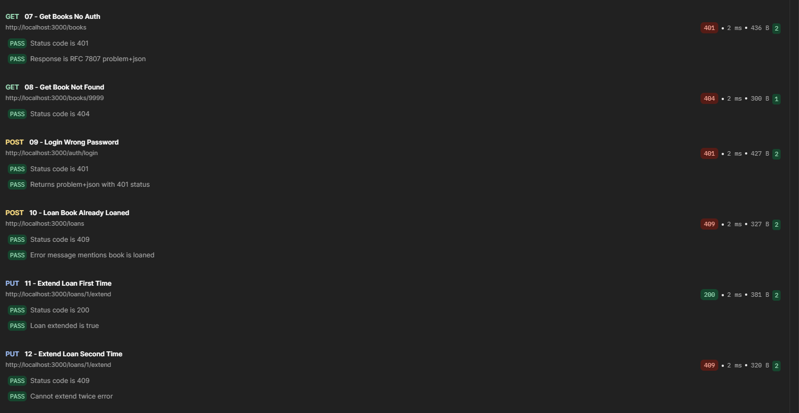

# Б хэсэг — Library Lending REST API

Номын сангийн ном зээлэх API. Express + TypeScript-р хийсэн.

## Endpoint-үүд

REST зарчмаар 4 нөөц + auth:

- `POST /auth/login` — JWT token авах
- `GET /books` — pagination, filter, sort дэмжинэ
- `GET /books/:id`, `POST /books`, `PUT /books/:id`, `DELETE /books/:id`
- `GET /members`, `POST /members`, `GET /members/:id`, `PUT /members/:id`, `DELETE /members/:id`
- `GET /loans`, `POST /loans` — ном зээлэх
- `PUT /loans/:id/extend` — сунгах
- `PUT /loans/:id/return` — буцаах
- `GET /reservations`, `POST /reservations`, `DELETE /reservations/:id`

## Бизнес дүрмүүд

`/loans` endpoint дээр хэдэн дүрэм хатуу хэрэгжүүлсэн:

- **5 ном лимит**: гишүүн нэгэн зэрэг 5-аас илүү ном идэвхтэй зээлсэн байж 
  болохгүй. Хэтэрвэл `422 Unprocessable Entity`.
- **14 хоногийн хугацаа**: шинэ зээл үүсэхэд `dueDate` нь `loanedAt + 14` хоног.
- **1 удаа сунгах**: `extended` талбар үнэн болсны дараа дахин сунгах боломжгүй. 
  `409 Conflict`.
- **Идэвхтэй зээлэгдсэн ном**: нэг ном хоёр гишүүнд нэгэн зэрэг зээлэгдэхгүй. 
  `409 Conflict`.

## HTTP статус код

- `200` — OK (GET, PUT)
- `201` — Created (POST)
- `204` — No Content (DELETE)
- `400` — Bad Request (талбар дутуу)
- `401` — Unauthorized (token дутуу/хүчингүй)
- `403` — Forbidden (эрх дутуу)
- `404` — Not Found
- `409` — Conflict (бизнес дүрэм зөрчсөн)
- `422` — Unprocessable Entity (5+ ном)

## Алдааны формат — RFC 7807

Auth алдаа болон `errorHandler` middleware-аас гарсан алдаа бүгд 
`application/problem+json` content type-тай байна. Бүтэц нь:

```json
{
  "type": "https://example.com/problems/401",
  "title": "Unauthorized",
  "status": 401,
  "detail": "Invalid or expired token",
  "instance": "/books"
}
```

## Технологи

- Node.js 20+
- TypeScript 5
- Express 4
- jsonwebtoken (JWT auth)
- cors

## Ажиллуулах

```bash
cd partB
npm install
npm start
```

Server `http://localhost:3000`-д ажиллана. Health check: `GET /health`.

Login хийхдээ:

```json
POST /auth/login
{
  "email": "admin@library.com",
  "password": "admin123"
}
```

Хариунд `accessToken` ирнэ. Дараагийн хүсэлтэд header-т нэмэх:

Authorization: Bearer <accessToken>

## OpenAPI 3.0

API тодорхойлолтыг `openapi.yaml` файлд бичсэн. Swagger UI эсвэл өөр yaml viewer 
дээр харж болно.

## Postman тестүүд

`postman/` хавтас доор collection + environment бий:

- `Library-API.postman_collection.json` — 12 request, 27 тест
- `local.postman_environment.json` — `baseUrl`, `token` гэх мэт хувьсагч

### Ажиллуулах

1. Postman доторх **Import** ашиглан хоёр файлыг нэмэх
2. `local` environment идэвхжүүлэх
3. **Run collection** дарж бүгдийг ажиллуулах

### Тестийн төрөл

**Эерэг тестүүд (6):**
- 01 — Login (token хадгалах)
- 02 — Get Books (pagination)
- 03 — Create Book (lastBookId хадгалах)
- 04 — Get Book by ID (chained — lastBookId ашиглах)
- 05 — Create Member
- 06 — Create Loan (lastLoanId хадгалах)

**Сөрөг тестүүд (4):**
- 07 — Get Books No Auth → 401 problem+json
- 08 — Get Book Not Found → 404
- 09 — Login Wrong Password → 401 problem+json
- 10 — Loan Book Already Loaned → 409

**Chained тестүүд (2):**
- 11 — Extend Loan First Time → 200, extended=true
- 12 — Extend Loan Second Time → 409 (нэгэнт сунгасан)

### Үр дүн

Бүх 12 request амжилттай ажилласан, нийт 27 assertion бүгд PASS.

Эерэг тестүүд (1-5):



Зээл үүсгэх тест (6):



Сөрөг ба chained тестүүд (7-12):



## Тулгарсан зүйлс

Token-ийн хугацаа 1 цаг байсан тул Postman дээр удаан ажиллах үед login дахин 
хийх шаардлагатай болсон. Эхлээд 24 цагтай болгох санаа байсан ч Postman Runner 
бүх 12 тестээ нэг дор ажиллуулдаг тул асуудалгүй гэж шийдсэн.

RFC 7807 шалгахдаа `pm.response.to.have.header("Content-Type", "application/problem+json")` 
гэж бичсэн чинь fail болов. Учир нь Express нь `; charset=utf-8` нэмж буцаадаг 
байсан. `pm.expect(contentType).to.include(...)` болгож зассан.